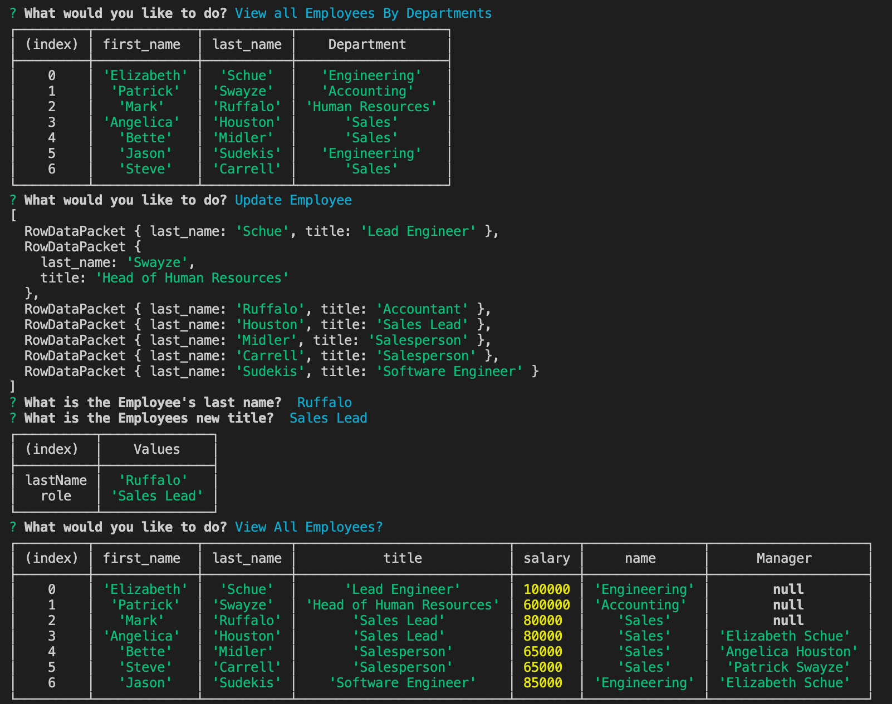
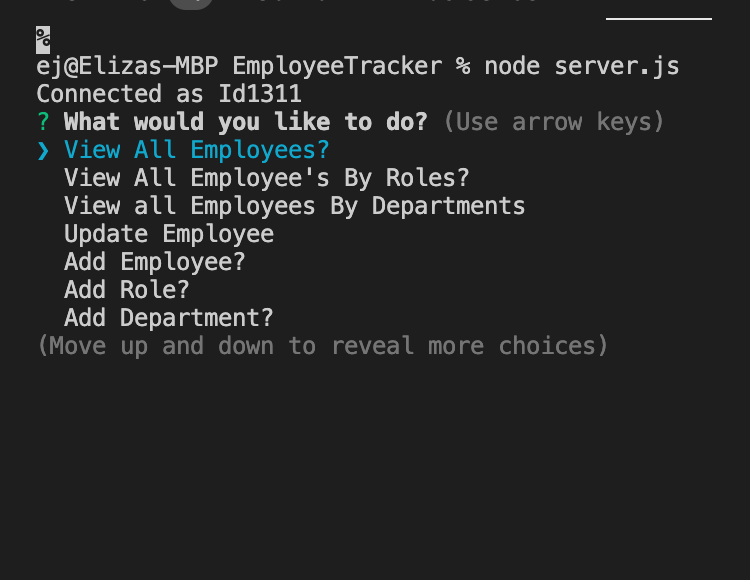

# Employee Tracker 
## Description
This project is for when you'd like a simple in line application that allows you to add employees, update their role, view all your employees, view all your employees by department, add roles, and add departments. It takes your input and creates an easy to read table in your console.
## Table of Contents
* [Installation Instructions](#installation)
* [Usage Info](#usage)
* [Contribution Guidelines](#contributing)
* [Test Instructions](#tests)
* [Questions](#questions)

## Installation
Open your integrated terminal, enter npm install to install the required dependencies, then use node server.js in order to run the application.

## Usage 
Use this to keep track of your current roster of employees!

## Contributing
Contact me on github with any contribution ideas.

## Tests

## License
MIT

## Questions
[Link to my Github](https://github.com/ejkennelly)

Contact email address if you have additional questions: elizakennelly@gmail.co

Click here for a link to a screen recording of the app in action! <a href="https://drive.google.com/file/d/1IlBl-EwR1TEo77c6UVeOzwVyPmBrIEUK/view?usp=sharing">VIDEO TUTORIAL</a>

I've included two screenshots, one of the landing page, and one of the tables you can expect to see.

